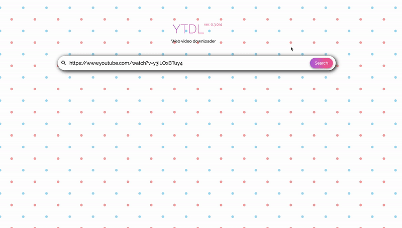

# YTDL WEB



Yet another Web application for downloading Youtube videos. Can download videos using different formats and in different quality.

## Stack

* [Python](https://www.python.org/)
* [ConfZ](https://github.com/Zuehlke/ConfZ) - config library for backend
* [FFMPEG](https://ffmpeg.org/) - video/audio processing
* [FastAPI](https://fastapi.tiangolo.com/) - API backend
* [Uvicorn](https://www.uvicorn.org/) - API application server
* [React.js](https://reactjs.org/) - frontend
* [Deta](https://deta.sh/) - database

# Run

Before starting the application you should create `.env` file in project root which will contain all necessary settings. Example configuraion for Docker container:
```shell
DEBUG=True
ALLOW_ORIGINS="http://localhost,http://localhost:8080,http://localhost:8081,http://127.0.0.1,http://127.0.0.1:8080,http://127.0.0.1:8081"
DATASOURCE__DETA_KEY=<your Deta key should inserted here>
DATASOURCE__DETA_BASE=<your deta base name should be inserted here>
MEDIA_PATH="/app/media"
```

After this simply run command below:
```shell
$ docker-compose up ytdl-web
```