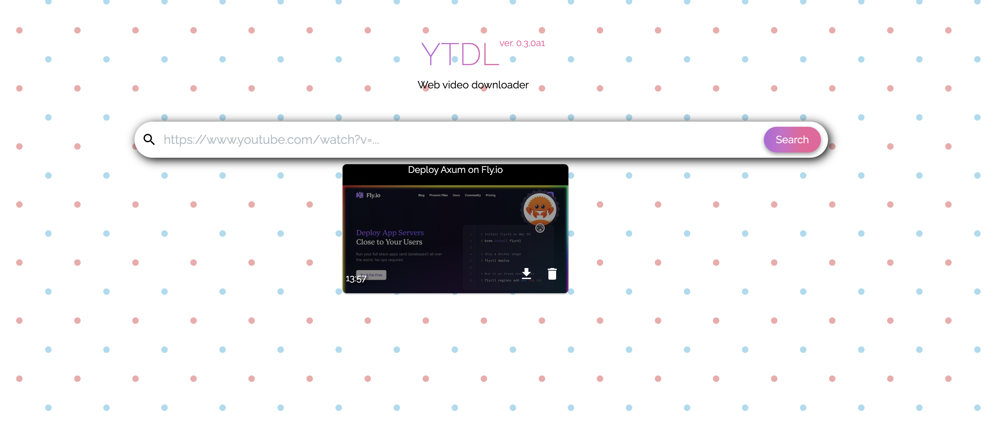

# YTDL-WEB

Web interface for YTDL API.



##  Requirements

* Node v12.15.0

## Installation
Run command below to install application locally.
```shell
$ npm install
```
## Configuration
Create `.env` file with variable referencing API's url. Example:
```
API_URL=http://localhost:8080
```

## Running application locally
```
$ npm run devserver
```

App should be automatically opened on http://localhost:3000